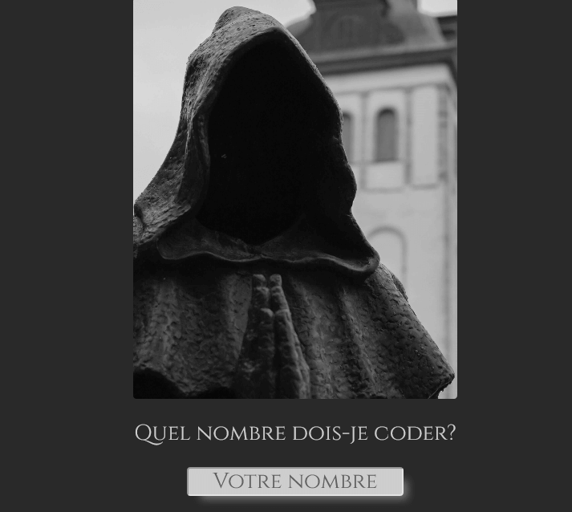

# Translate Indo-Arabian numbers in Cistercian Numbers

Cistercian numerals were developed in the early XIIIth century.
They were used to number pages, indicate years or listing.
This version allows to generate numbers from 1 to 9999.

First project with Canvas

